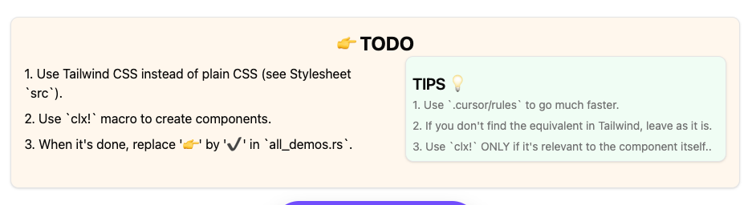

# General Purpose

This repository is designed to be a collaborative working space for creating components for Leptos and Dioxus.

It's only a temporary repository to test and develop components. Once they are ready, they are integrated directly into [Rust UI](https://rust-ui.com/).





# 👾 Discord

You can join the [Discord server](https://discord.gg/mbszS27TqA) to ask questions, discuss the project, and chat about Rust in general — including job opportunities and more.


# Setup

## Installation

Please refer to [Leptos](https://github.com/leptos-rs/leptos?tab=readme-ov-file#nightly-note/) or [Dioxus](https://github.com/DioxusLabs/dioxus?tab=readme-ov-file#running-the-examples) documentation.


You will need these VSCode extensions:
- [Rust Analyzer](https://marketplace.visualstudio.com/items?itemName=rust-lang.rust-analyzer)
- [Biome JS](https://marketplace.visualstudio.com/items?itemName=biomejs.biome)


Don't forget to :
- `rustup update`
- `cargo install-update -a`
- `cargo update`
  
- `git pull origin master --rebase`


## Run the project

```bash
cargo leptos watch
```


# 💡 Tips

## CSS

If possible, try to use `this__pattern` for custom CSS classes that you didn't manage to convert to Tailwind.
This way, we can distinguish them easily.

Example:

```css
.img__holder {
    clip-path: polygon(37.5% 20%, 62.5% 20%, 62.5% 80%, 37.5% 80%);
    transform: rotate(30deg);
}
```


## JS

At the moment, it's probably better to **keep the JS as it is** and not use Rust for interacting with the DOM.
While using wasm-bindgen or web_sys is possible, it seems overkill for the moment.

The main goal here is to convert index.html into reusable components in Rust.

If possible, you can try to use **inline JS** to avoid having a `script.js` file to manage.

Example:

Instead of having this:

```html
<button id="my__button">Show an alert</button>

<script>
  document.getElementById('my__button').addEventListener('click', () => {
    alert('Hello from JS!');
  });
</script>
```

Prefer to have this:

```html
<button onclick="alert('Hello from JS!');">
  "Show an alert"
</button>
```

PS: This is not mandatory, just a nice to have 😄


# License

This project is licensed under the MIT License. See the [LICENSE](LICENSE) file for details.
