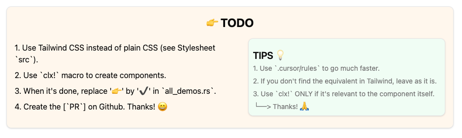

# Rust UI Labs

## General Purpose

This repository is designed to be a collaborative working space for creating components for Leptos and Dioxus.

It's only a temporary repository to test and develop components. Once they are ready, they are integrated directly into [Rust UI](https://rust-ui.com/).





## 👾 Discord

You can join the [Discord server](https://discord.gg/mbszS27TqA) to ask questions, discuss the project, and chat about Rust in general — including job opportunities and more.


## Installation

Please refer to [Leptos](https://github.com/leptos-rs/leptos?tab=readme-ov-file#nightly-note/) or [Dioxus](https://github.com/DioxusLabs/dioxus?tab=readme-ov-file#running-the-examples) documentation.


You will need these VSCode extensions:
- [Rust Analyzer](https://marketplace.visualstudio.com/items?itemName=rust-lang.rust-analyzer)
- [Biome JS](https://marketplace.visualstudio.com/items?itemName=biomejs.biome)


Don't forget to :
- `rustup update`
- `cargo install-update -a`
- `cargo update`
  
- `git pull origin master --rebase`


## Run the project

```bash
cargo leptos watch
```


## License

This project is licensed under the MIT License. See the [LICENSE](./LICENSE) file for details.
